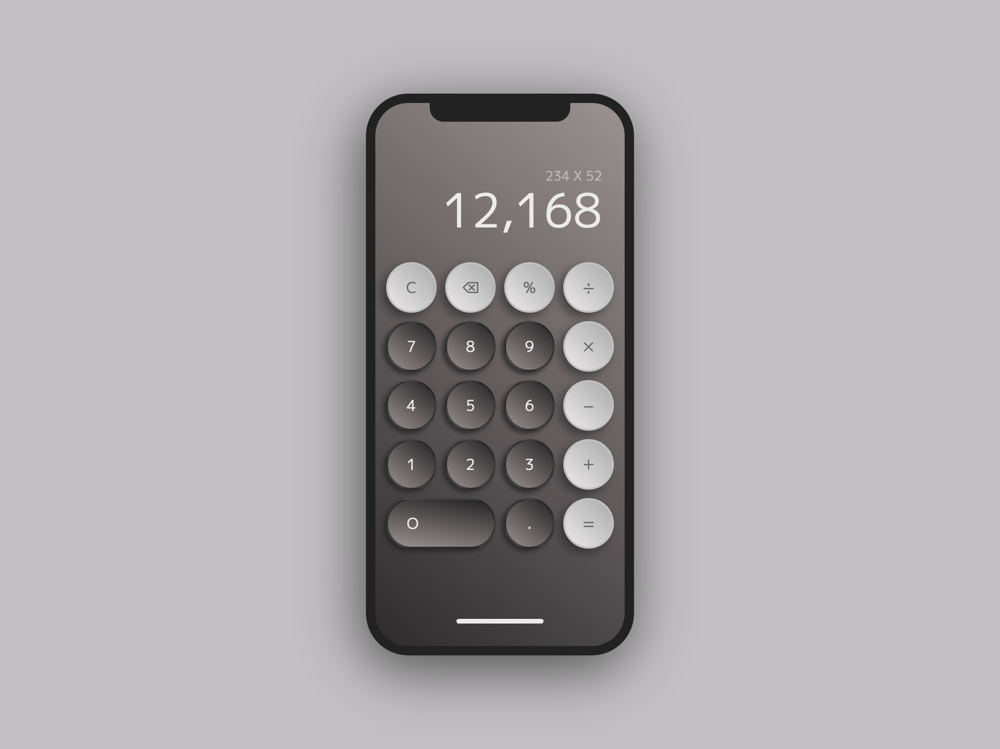

# Vanilla Calculator｜立即顯示結果的優雅計算機

### 專案簡介

這個計算機的視覺設計並非完全原創，而是基於 Instagram 帳號 `@uixperience` 的作品進行參考與改編，成功還原了 iPhone 計算機的外觀。在外觀與互動上，我透過改變陰影效果模擬實體按鈕被壓下的真實感，也結合 CSS `@keyframes` 動畫，實現按下清除鍵時數字向左淡出的效果，以及對計算結果的數字設計四種字體大小，以在長度增減時做出自動的調整；在開發上，我採用 [CSS Nesting](https://developer.chrome.com/docs/css-ui/css-nesting?hl=zh-tw) 代替先前愛用的 Sass，讓開發變得更為簡單和輕量化，另在執行數學運算的部分，我選擇使用更為安全和高效的 `new Function()` 代替 [`eval()`](https://developer.mozilla.org/zh-CN/docs/Web/JavaScript/Reference/Global_Objects/eval)，並使用 JavaScript 物件的 [getter](https://developer.mozilla.org/zh-TW/docs/Web/JavaScript/Reference/Functions/get) 方法一同管理輸入內容、運算式和計算結果，做到將資料與控制輸入、更新畫面的邏輯區分離。值得ㄧ提的是在計算機的交互上，解決了許多可能導致計算錯誤或無法執行的問題，例如一開始輸入 "0" 在繼續輸入其他數字，計算可以運行但可能會出錯，又或是將運算符作為起始字符輸入、在 "%" 後直接輸入數字、連續輸入多個運算符或小數點、在小數點後接上運算符...等，都會導致算式無法運行，而一一改善這些細節都讓操作體驗逐漸變得更好。在這次專案的實作中，我融入了許多個人的 UI/UX 設計思考，並細緻調整了計算邏輯與操作細節，這次經驗不僅是一次開發技術的實踐，也打磨出了一個令我感到成就感滿滿的作品！

### 外觀互動設計 & 開發紀錄

- 使用專為網頁設計的 WOFF2 (Web Open Font Format) 格式字體搭配 CSS `@font-face` 達成字體自託管。
- 為計算機按鈕設計按壓前後的陰影效果以模擬光線在真實按鈕上的視覺感受。
- 搭配 `new Function()` 進行數學運算，讓計算結果即時反饋，並將輸入和計算結果的數字以千分位表示，提升操作體驗和易用性。
- 將輸入顯示的數字小數點位數限制為 6 位，計算結果的小數點位數限制為 4 位。同時，為計算結果設計了四種字體大小，能根據數字的長度自動切換對應的樣式，從而兼顧整體佈局的美觀與實用性。
- 利用 JavaScript 物件的 getter 方法，有效管理輸入內容、運算式與計算結果，並實現了資料與操作邏輯的分離，提升代碼的結構性與可維護性。
- 結合 DOM 操作與 Regex 正規表達式判斷，改善許多可能導致計算錯誤或無法執行的輸入，使計算更加準確且流暢，大幅提升操作體驗。

---

## Vanilla Calculator | An elegant and minimalistic calculator that provides instant results with every input.

### Project Overview

This calculator's visual design is not entirely original but is inspired by and adapted from the works of the Instagram account `@uixperience`, successfully recreating the appearance of the iPhone calculator. In terms of both aesthetics and interactions, I implemented shadow effects to simulate the realistic tactile response of physical buttons being pressed. Additionally, I utilized CSS `@keyframes` animations to achieve a smooth left fade-out effect when the clear button is pressed. The display of calculation results is designed with four font sizes, which automatically adjust based on the length of the input to maintain visual balance and usability.

From a development perspective, I adopted [CSS Nesting](https://developer.chrome.com/docs/css-ui/css-nesting?hl=zh-tw) to replace my previously preferred Sass, making the development process more streamlined and lightweight. For mathematical operations, I opted for the safer and more efficient `new Function()` over [`eval()`](https://developer.mozilla.org/zh-CN/docs/Web/JavaScript/Reference/Global_Objects/eval). Furthermore, I utilized the [getter](https://developer.mozilla.org/zh-TW/docs/Web/JavaScript/Reference/Functions/get) method in JavaScript objects to manage input content, expressions, and results, ensuring a clear separation of data handling, input control, and screen updates.

One of the highlights of this project is the refinement of interactive logic to address various edge cases that could lead to calculation errors or inoperable expressions. For example:

- Starting with a "0" and then inputting additional numbers, which could cause unexpected behavior.
- Using an operator as the first character of an expression.
- Entering a number directly after the "%" operator.
- Inputting consecutive operators or decimal points.
- Adding an operator immediately after a decimal point.

By meticulously addressing these details, I significantly enhanced the user experience, making the calculator more reliable and intuitive.

This project combines my personal insights into UI/UX design with careful adjustments to computational logic and operational nuances. It has been both a practical exercise in development techniques and a rewarding journey of crafting a polished and functional product that brings me immense satisfaction.

## Highlights of Visual Design, Interaction Design, and Development

- Used WOFF2 (Web Open Font Format) fonts with CSS `@font-face` to enable self-hosted typography optimized for the web.
- Designed shadow effects for button states to mimic the realistic lighting and tactile feedback of physical buttons.
- Integrated `new Function()` for mathematical computations to ensure real-time feedback and displayed results with thousands separators for enhanced readability and usability.
- Displayed input numbers are limited to 6 decimal places, while calculation results are capped at 4 decimal places. Additionally, four font sizes have been designed for displaying results, allowing automatic adjustments based on the length of the numbers. This ensures a visually appealing and practical layout.
- Leveraged JavaScript object getters to efficiently manage input, expressions, and results, achieving a clear separation of data handling and operational logic for better code maintainability.
- Combined DOM manipulation with regular expressions (Regex) to validate and improve input logic, resolving potential issues that could lead to errors or non-functional expressions. This significantly enhanced accuracy and streamlined the overall user experience.
